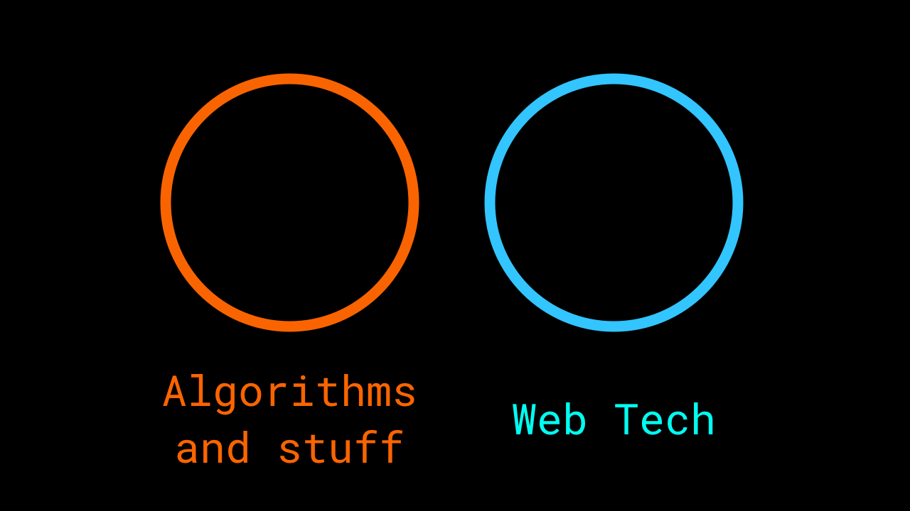
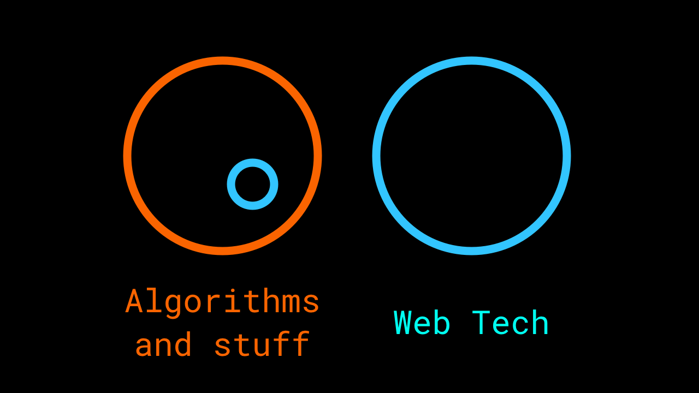
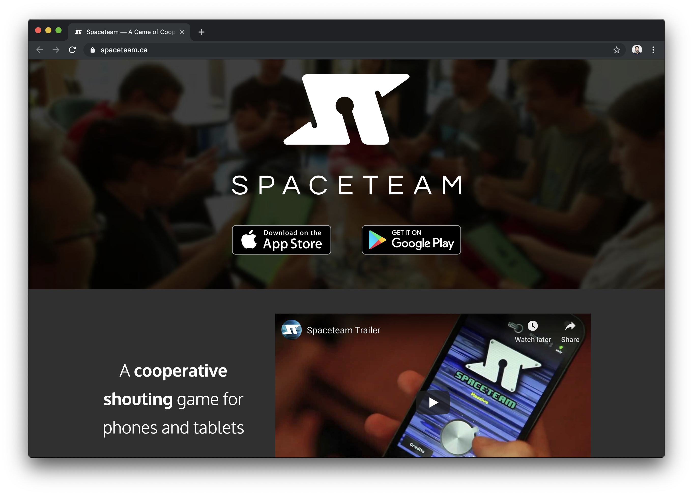
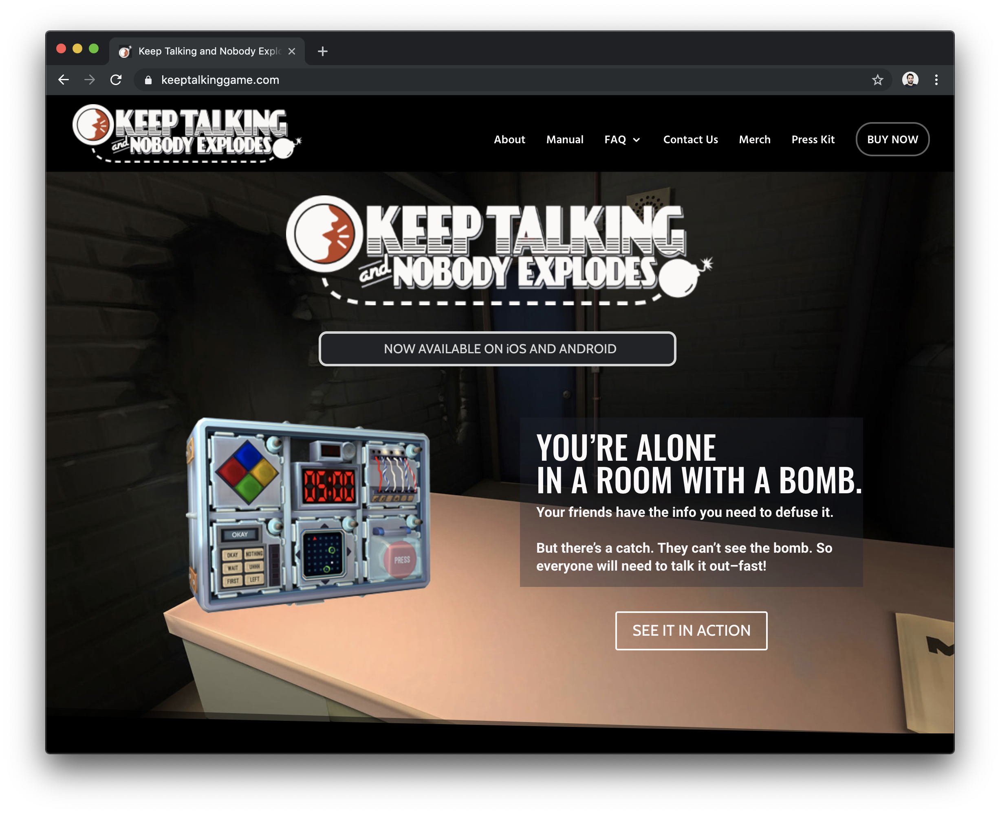

# Hello,
# [fit] I'm Ben
## Thanks for having me
# 🦉

---

# Selected projects

* Fairy lights
* NZ - stuffometer
* WebGL Hacks
* Publishing rooms

---


---


^ we have cars that drive around the place

---


---


---

# [fit] Taking the 
# [fit] web on an
# [fit] adventure

^ Making the web useful down the stack

---




---




---


---

# 🦉 Today

---

# 🦉 Today

# [fit] Challenging 
# [fit] the way we 
# [fit] build the web

^ gonna talk about some technical stuff, as well as dipping into UX and design.

---

<!-- # [fit] Paradigms  -->

# [fit] Received 
# [fit] Wisdoms

<!-- # [fit] Convention -->

<!-- # [fit] Assumptions -->

---

# [fit] 1.

[.background-color: #f08]

---

# [fit] 1.

# [fit] Use JSON 
# [fit] for data

[.background-color: #f08]

---


---


---


---


---

# [fit] JSON

(2001)

^ JSON - March 2001

---


```json
{
  "list": [
    {
      "body": "I totally identify with this", 
      "author_id": "038bb12m", 
      "created_at": 12345,
      "spam": false
    }
  ]
}
```

---


```js
const content = {
  "list": [
    {
      "body": "I totally identify with this", 
      "author_id": "038bb12m", 
      "created_at": 12345,
      "spam": false
    }
  ]
}
```

---


<!-- [^1]:https://www.webdesignmuseum.org/web-design-history/netscape-navigator-2-0-1995. -->

^ NN2 - Sept 1995
^ JSON - March 2001 (6 years later)

---

# JSON is baked 
# into the web platform


```js
const comments = await response.json()
```

---

# An alternative?

---

# [fit] Protocol
# [fit] Buffers

[.background-color: #ccc]

---

# Define a message

```
# example.proto

syntax = 'proto3';

message Example {
    string name = 1;
    bool night = 2;
    float size = 3;
}
```

---

# Generate stubs

```bash
protoc 
  --js-out=./dist
  example.proto
```

---

# Use stubs


```js
const message = new Message()
message.setName('frank')
message.setNight(false)
message.setSize(2)

const output = message.serialiseBinary()
// -> Buffer(...)
```

---


# ❤️Protocol Buffers ❤️

* impossible to make a mistake
* efficient on the wire
* Type safety __across__ languages

[.build-lists: true]

---


# Generated data

```
0010010101010001010010010010101
0101010100010120100100101010011
1000101001001001010101000101...
```

---

# Tags

```
{1}0010010101010001010010010010101
0101010{2}100010100100100101010011
10001010010010010{3}10101000101...
```

```
string name = {1};
bool night = {2};
float size = {3};
```

---

# Efficiency


# [fit] 1234567890

```
# JSON
000000  31 32 33 34 35 36 37 38 39 30                    1234567890

# Var Int
000000  d2 85 d8 cc 04                                   Ò.ØÌ.
```


[observablehq.com/@benfoxall/var-int-encoding](https://observablehq.com/@benfoxall/var-int-encoding)

---

# Efficiency

# [fit] true

```
# JSON encoded
000000  74 72 75 65                                      true

# Var Int (1)
000000  01                                               .
```

---

```bash
protoc 
  --js-out=./dist
  --python-out=./dist
  --go-out=./dist
  --rust-out=./dist
  example.proto
```

---

# [fit] Demo


---


# [fit] 2.

[.background-color: #f08]

---

# [fit] 2.

# [fit] Use REST 
# [fit] for interfaces

[.background-color: #f08]

---


---

# [fit] REST
# [fit] Representational state transfer

(2000)


<!-- [^rest]: https://www.ics.uci.edu/~fielding/pubs/dissertation/rest_arch_style.htm -->

^ Year 2000

---

GET /posts
GET /posts/53
GET /posts/53/comments
PUT /posts/53/comments/23/reactions
POST /posts/53/comments


---

# Built on HTTP


<!-- https://home.cern/science/computing/birth-web -->

---

# REST is baked 
# into the web platform

---


# An alternative?
<!-- 
* loose
* manual -->

---

# [fit] gRPC

[.background-color: #ccc]

---

# Resources → Services

---

```
POST PostService/getList
POST PostService/getPostContent
POST CommentService/getComments
POST CommentService/setReaction
POST CommentService/addComment
```

---

```bash
# example.proto
service ExampleService {
  rpc Add (NumberList) returns (Number);
}

# use grpc plugin
protoc
  --plugin=protoc-gen-grpc=grpc-plugin \
  --grpc_out=. \
  example.proto
```

---

```js
const client = new ExampleServiceClient('localhost:5050')

const answer = await client.add(5, 5)

// 10
```

---

# ❤️gRPC ❤️


* Interface code is generated / mistake free
* Type safety __between__ langages


[.build-lists: true]

---

# 🤫 gRPC – slight probleem

* It's not supported by web-browsers
* At all
* Option – web-gRPC ⇔︎ gRPC bridge:
  * grpcwebproxy
  * envoy proxy
  * wait a while

[.build-lists: true]

---

# [fit] Demo

---

# [fit] 3.

[.background-color: #f08]

---

# [fit] 3.

# [fit] Browsers connect
# [fit] to web servers

[.background-color: #f08]

---


---
<!-- 

--- -->

[ two browsers ]

---

[ two browsers ]

[ web server ]

---

# An alternative?

---

# [fit] PeerToPeer
# with 
# [fit] WebRTC
# datachannels

[.background-color: #ccc]

---

[ two browsers ]

[ web server ]

---

[ TURN / STUN ]

[ two browsers ]

[ web server ]

---

# Data

* Media streams
* Data Channels

[.build-lists: true]

---

# ❤️ WebRTC DataChannels ❤️

* Appropriate latency & bandwidth
* Interactive applications

[.build-lists: true]

---


# [fit] Quick Summary

[.background-color: #08f]

---

# [fit] 1. Protocol Buffers
# [fit] 2. gRPC 
# [fit] 3. webRTC

[.background-color: #08f]

---

# [fit] 1. Serialisation
# [fit] 2. Interface
# [fit] 3. Transport

[.background-color: #08f]

---

Two windows

[ ] [ ]

---


Two windows

[ ] --- [ ]

webRTC connection

---

Two windows

[ ] --- [ ]

Nominate "Server", and "Client"

---

Two windows

[ ] --- [ ]

Use gRPC semantics to add typing to the connection

---

Web Server, inside a web browser

---

# [fit] [prpc.me](https://prpc.me)

---

# Code Example

---


# 1. Define a service

```
syntax = 'proto3';

message NumberPair {
    float value1 = 1;
    float value2 = 2;
}

message Result {
    float value = 1;
}

service CalculatorService {
    rpc Calculate (NumberPair) returns (Result);
}

```

---

# 2. Write Server/Client components

```jsx
const Client: FunctionComponent = () => {
    const [a, setA] = useState(1)
    const [b, setB] = useState(1)
    const [result, setResult] = useState<string | number>('?')

    const calculate = () => {}

    return (
        <div className="Calculator">
            <input type="number" value={a} onChange={e => setA(e.target.valueAsNumber)} />
            ?
            <input type="number" value={b} onChange={e => setB(e.target.valueAsNumber)} />
            =
            <output onClick={calculate} tabIndex={0}>{result}</output>
        </div>
    );
}


const Server: FunctionComponent = () => {
    const server = useContext(ServerContext)
    const [operation, setOperation] = useState('+');

    return (
        <div className="Calculator">
            <select value={operation} onChange={e => setOperation(e.target.value)} >
                <option>+</option>
                <option>-</option>
                <option>/</option>
            </select>
        </div>
    )
}


export const Calculator = { Server, Client }
```


---

# 3. Hook them together

```ts
// <Calculator.Server>
server.addService(CalculatorService, {
    Calculate: (req, res) => {
        res.setValue(
            compute(
                req.getValue1(),
                operation,
                req.getValue2(),
            )
        )
    }
})

// <Calculator.Client>
const calculate = () => {
    const calc = client.getService(CalculatorService)

    calc('Calculate', (req) => {
        req.setValue1(a)
        req.setValue2(b)
    }).then(res => {
        setResult(res.getValue())
    })
}
```

---

# [fit] prpc.me

## /Calculator

---


# ...


---

# [fit] 4.

[.background-color: #f08]

---

# [fit] 4.

# [fit] Data lives in
# [fit] a data centre

[.background-color: #f08]

---

[ SERVER ]

Throw your data somewhere
do something with it

---

Great, because ownership.

---

# An alternative?

---

# [fit] Peer-to-peer
# [fit] storage

[.background-color: #ccc]

---

# [fit] prpc.me

## /Content
## /Chat

---

# [fit] Distributed web

---


---


---

# ❤️ Distributed web ❤️

* It feels like we own it
* Performance potential

[.build-lists: true]

---


# [fit] 5.

[.background-color: #f08]

---

# [fit] 5.

# [fit] Interaction & Focus
# [fit] happen on the same device

[.background-color: #f08]

---


---

# An alternative?

---

# [fit] Multi
# [fit] device
# [fit] interactions

[.background-color: #ccc]

---

# [fit] prpc.me

## /Draw

---

### [fit] Focus
### Interaction


---

### [fit] Big screen
### Small phones

---


---


---


---


---

# ❤️ Multi device interactions ❤️

* Bridges between tech and our environment
* Make the most of device capabilities

[.build-lists: true]

---


---

---

---


# Game UX

---



---


---




---

# [fit] ↑ NEW
# [fit] ↑ STUFF

---

# 🦉 Today

## Challenging the state 
## ...


---

# 🦉 Today

## Challenging the state 
## of how we load data

---

# 🦉 Today

* Technical stuff
* Demo stuff
* Concept stuff

[mark where it sounds like it's going to be boring]

^ I'm going to introduce a technical topic, that has non-technical ramifications

---

# How do we get 
# data into a web page?

---


---


---


---


^ INTERFACE
^ SERIALISATION

---


# [fit] Interface

agreemenent between parties

# [fit] Serialisation

conversion to (common) format

---

# Interface

# [fit] REST

---

# URL
# /post/1b982/comments

---

# Methods
# GET, POST, PUT, DELETE


---

#  REST

* Stateless
* Resource Oriented
* Been around forever
* Great
* HATEOAS

---

# [first ever web browser]

---

# Serialisation

# [fit] JSON

---

```json
{
  "list": [
    {
      "body": "I totally identify with this", 
      "author_id": "038bb12m", 
      "created_at": 12345,
      "spam": false
    }
  ]
}
```

---


```js
const content = {
  "list": [
    {
      "body": "I totally identify with this", 
      "author_id": "038bb12m", 
      "created_at": 12345,
      "spam": false
    }
  ]
}
```

---

Netscape

---

# JSON

* JavaScript Object Notation
* Been around forever (every javascript version could handle it)
* efficient
* defacto [because JS was historically the only language]

---


```js
const content = JSON.stringify(`{
  "list": [
    {
      "body": "I totally identify with this", 
      "author_id": "038bb12m", 
      "created_at": 12345,
      "spam": false
    }
  ]
}`)
```

---

```js
const content = {
  "list": [
    {
      "body": "I totally identify with this", 
      "author_id": "038bb12m", 
      "created_at": 12345,
      "spam": false
    }
  ]
}
```

---

# Browser <-> Server

### Interface
## REST

### Object Serialisation
## JSON


---

# TODO - HOW DO SERVERS TALK TO OTHER SERVERS

---

* networking is different (containers/microservices)
* HTTP optional
* JavaScript not dominiant

---

# [fit] Lots of ways
# [fit] htttp / queues / sockets / etc

---

# today we'll look at
# [fit] gRPC &
# [fit] Protocol Buffers 

---

# Not New **or** Trendy

^ https://trends.google.com/trends/explore?date=all&q=protocol%20buffers


---


---

# TODO - SERVER ======= SERVER

---


---


# Other Terms

- client / server
- request / response
- 

---

# Protocol Buffers

## → Serialising Objects

# gRPC

## → Building APIs

---

# Popular & Prolific

---

# Popular & Prolific

## … but not so much in the web

---

# …because with the web

## Serialising Objects → JSON

## Building an API → REST

---

<!--


---

-->


---


---
# [fit] Going from JSON
# [fit] to Protocol 
# [fit] Buffers

[.background-color: #ffcc00]

<!---

# getting to
# [fit] Protocol Buffers

# from
# [fit] JSON
-->

---

# JSON → Protocol Buffers

---


---

## Store things better-er

# [fit] 1234567890

```
# JSON
000000  31 32 33 34 35 36 37 38 39 30                    1234567890

# Var Int
000000  d2 85 d8 cc 04                                   Ò.ØÌ.
```


[observablehq.com/@benfoxall/var-int-encoding](https://observablehq.com/@benfoxall/var-int-encoding)

---

## Store things better-er

# [fit] true

```
# JSON encoded
000000  74 72 75 65                                      true

# Var Int (1)
000000  01                                               .
```

---

## Store things better-er

# [fit] 123e4567-e89b-12d3-a456-426655440000

```
# JSON encoded
000000  31 32 33 65 34 35 36 37 2d 65 38 39 62 2d 31 32  123e4567-e89b-12
000010  64 33 2d 61 34 35 36 2d 34 32 36 36 35 35 34 34  d3-a456-42665544
000020  30 30 30 30                                      0000

# Raw bytes
000000  12 3E 45 67 E8 9B 12 D3 A4 56 42 66 55 44 00 00 
000010  B
```

^ TODO - it might be better to to data-uri here

---


---


---


---


---


---


---

# [fit] 🎉 We've 🎉 
# [fit] 🎉 Invented 🎉 
# [fit] 🎉 Protocol Buffers 🎉 

---

# 1. 📝 `message.proto` 
# 2. 🤖 `message_pb.js` 
# 3. ✨ `new Message()`

---

# ⚡️ Demo

```
message Example {
    string name = 1;
    bool burger = 2;
    float howMuch = 3;
}
```

---

# The Good stuff

---

# Typed messages across multiple langauges


```bash
protoc example.proto
  --js-out=… 
  --python-out=…
  --c-out=…
```

---

# Avoids translation

```sql
SELECT * FROM comments WHERE …
```

1. Comment model class

2. Rest API Layer

3. fetch(…).then(r => r.json())

4. Comment.fromJSON()

5. <Comment title={item.title}>

[.build-lists: true]

---

# [fit] Going from REST to
# [fit] gRPC


[.background-color: #ffcc00]

---
<!--
# RPC

# a function in your code might transparently run somewhere else

---

-->

# Goals

* REST - Modelling state
* gRPC - Calling remote functions

[.build-lists: true]

---

# Architectural Models

* REST - Resource Oriented
* gRPC - Service Oriented

[.build-lists: true]

---

# REST - Resource Oriented
## Identifier

```
GET /posts/42/comments/15
```

↑ Relates to a resource

---

# gRPC - Service Oriented
## Identifier

```
CommentService/LoadComment
```

↑ Relates to a service method

---

# Interactions

* Request / Response (REST & gRPC)
* Request / Responses (gRPC)
* Requests / Response (gRPC)
* Requests / Responses (gRPC)

[.build-lists: true]

---

# Transport

* REST - HTTP1/HTTP1.1/HTTP2/…
* gRPC - HTTP2

[.build-lists: true]

---

<!--
# Why Only HTTP2


slideshare.net/Enbac29/http2-standard-for-video-streaming

^ you wouldn't want a waterfall when calling functions

---

-->

# [fit] Browser Support 

---

# [fit] Browser Support - REST

# [fit] 100%

---

# [fit] Browser Support – gRPC

# [fit] 0%

---

# gRPC-web [^1]


[^1]: [github.com/grpc/grpc/blob/master/doc/PROTOCOL-WEB.md](https://github.com/grpc/grpc/blob/master/doc/PROTOCOL-WEB.md)

---

# Using gRPC-web today

1. Use grpc-web-proxy
2. Use Envoy Proxy
3. Wait for tomorrow

[.build-lists: true]

---

> In the future, we expect gRPC-Web to be supported in language-specific Web frameworks, such as Python, Java, and Node.

---

# The
# Totally
# Cool
# Awesome
# Thing

----

# gRPC interfaces are typed

```bash
# calculator.proto
service Calculator {
  rpc Add (NumberList) returns (Number);
}


# use grpc plugin
protoc calculator.proto
  --plugin=protoc-gen-grpc=grpc-plugin \
  --grpc_out=.
  

# generated ./calculator_grpc_pb.js
```

---

# Demo

```
service Zoom {

    rpc echo(EchoMessage) returns (EchoMessage);

    rpc systemInfo (Noop) returns (stream SystemInfo);
    
    rpc screenShot (Noop) returns (Image);

    rpc setColorScheme (ColorSchemeRequest) returns (Noop);

}
```

---

## Why this is so cool

* Updating a service
* Microservices ↔︎ Components[^*]
* Avoid siloing

<!--* WebAssembly-->


[^*]: https://martinfowler.com/articles/micro-frontends.html

[.build-lists: true]

<!--

---

## Why it feels weird

* The web *is* REST
* JS has been a single language on a platform
* Obfuscation sucks
* We're used to things being fuzzy
* Accessibility 

^ Hypermedia as the engine of application state

<!--

"A REST API should never have “typed” resources"
https://roy.gbiv.com/untangled/2008/rest-apis-must-be-hypertext-driven

-->

---

# Quick summary

* Protocol Buffers
* gRPC


---


---


---

# Peer RPC

---


---


---


---


---


---


---


---

```ts
new PeerServiceServer(Zoom, {
  echo: (req, res) => {
    res.setText(
      req.getText()
    )
  },
  setColorScheme: (req) => {
    document.body.style.background =
      req.isDark() ? '#000' : '#fff'
  },
})
```

---

# Demo

* Zoom Service (Web edition)

---

# The good stuff

---

# The good stuff

## Interaction modes

---

# The good stuff

## Realtime

```ts
new PeerServiceServer(Zoom, {
  echo: (req, res) => {
    res.setText(
      req.getText()
    )
  },
  setColorScheme: (req) => {
    document.body.style.background =
      req.isDark() ? '#000' : '#fff'
  }
})
```

---

# Building interfaces

```
service Controller {
  rpc joystick(repeated Move) returns (Noop);
  rpc press(Button) returns (Noop); 
}
```

---

# Summary

* Protocol Buffers
* gRPC
* pRPC

---

# [PART 2]
# Challenging the state of interaction

---

# prpc.me

(keep this open)

[todo: debug - list of emoji buttons]

[talk through disconnections]

---

## Statement 1

# Web Content needs to come from a web server

[.background-color: #f0f]

---

# 🌮 Demo /Content

---

## What we just saw

* peer to peer data
* server unaware of content

---

## Other things

* DAT
* Beaker Browser
* IPFS

---

## Statement 2

# We need to the cloud to store data

[.background-color: #fc0]

---

# 🌮 Demo /Chat

---

## What we just saw

* A client-side datastore
* Who owns the data?
* Is GDPR an issue?
* What is authentication?


---

## Other things

* IndexedDB
* 

---

## Statement 3

# Web servers live in a datacentre

[.background-color: #0cf]

---

# 🌮 Demo /Draw

---

## What we saw

* different places of input & attention
* multi-device interactions

---

# Other things

* Space-Team – asymetrical interactions
* iPad handoff – making use of device capabilities
* Johann Sebastian Joust - inverse, don't need a computer

---

## Statement 4

# Web browsers only browse the web

[.background-color: #0cf]

---

# 🌮 Demo [todo] OFFLINE BLE

---

## What we saw

* The offline web 
* Web Bluetooth

---

# Other things

* Espruino

---

## Statement 5

# We only post text content

[.background-color: #0cf]

---

## What we saw

* GetUserMedia

---

# Other things

* Speech recognition
* Privacy/grant issues


---

## Statement 6

# Web interactions span the globe

[.background-color: #0cf]

---

# 🌮 Demo [todo] NEW POSITIONING STUFF

---

## What we saw

* AR markers
* Web Audio
* Space Matters

---

# Other things

* WebXR
* Apple Wideband?

---


https://www.webdesignmuseum.org/web-design-history/netscape-navigator-2-0-1995


---

# Thanks

@benjaminbenben


-------


Demo Stream of thought.

The srtuff I'm wanting to show here is how mazing it is that two browsersw aren't connected to the web, but can still do lots of things.


The first demo!

(we're thinkinhg in challenges here).

We don't need to access the www to get content.

The first demo challenges that servers don't have to be connected to the world wide web. Once you've visited this page, your browser disconnects from the web, but is still able to get content from this other web server.

??? Maybe a content demo?  I write markdown and that content is mirrored in peoples devices ???

>> potentially go on to talk about offline apps and bluetooth


Challenge number 2!

We don't need to post our data into the cloud.

Here's a comment bot - like that example we had before.  As you type in messages here, they're sent to everyone else who's joined the server!  Where this gets interesting is when you think about where the data is stored.  These comments are just a local variable in this browser.  What does that mean for privacy laws?  Am I breaking any data retention laws?!

To a point, we've been thinking about this kind of stuff with whatsapp end-to-end messages.  But what else does that mean.

>> potentially go on to talk about ipfs & distributed content.


Challenge number 3!

A web server can be part of the interaction

Here's another demo,  you can drag your finger or mouse across the panel, and you should be able to see it appear.

Now, I want to do a few things.  I want you to be kind of ANGRY,  now try and thing flow-y thoughts and drift about.  

Now I want you to try and make a circle.

And a square

And a triangle.

So,  What I love about this is where our focus lies.  When we interact, we tend to do so looking at a single screen.  I find it really interesting when we manage to interact with the spaces between. 


Challenge number 4!

A Web Server doesn't just have to serve the web.


>>
>> iPad handoff thing

>> space team / Artemis
>> Johann Sebastian Joust
>> 
>> 


Constraints.  Push button. Single dimension game berlin. 
Constrain. A web browser doesn’t have to just browse the web. (Ble)
