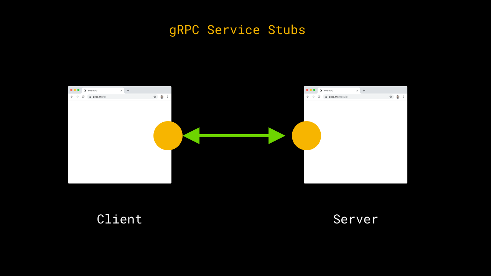
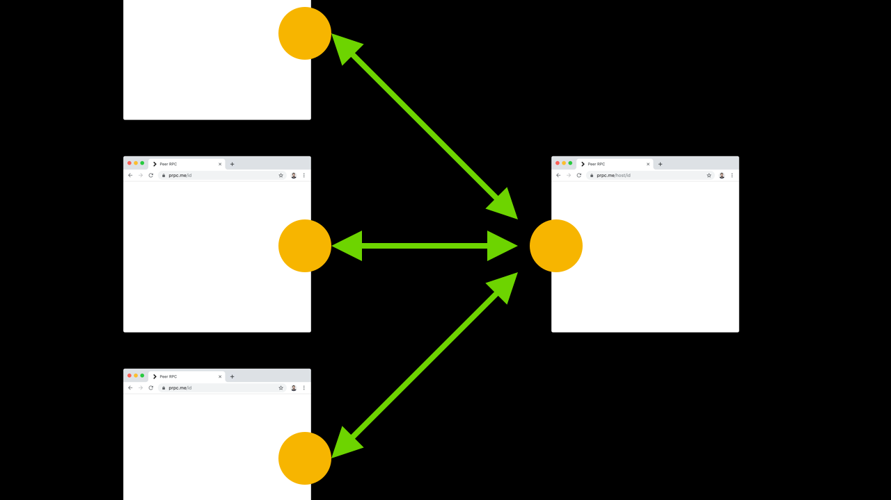

# I'm

# [fit] Ben

# [fit] Foxall

<!-- # [fit] Oxbotica -->

---


---


^ we have cars that drive around the place

---


---

# [fit] the web team

^ Do we drive cars with Javascript? …No

---


---


^ If you find that interesting, then give me a shout

---

# Today

^ That was work stuff, but I'm going to talk about something different

---

# Today

# [fit] gRPC +

# [fit] Peer to Peer

^ sounds dry, but we'll talk about history, protocols, through to how technology should feel

---

# [fit] Changing

# [fit] the way we

# [fit] build the web

---

### Structure

# → What we do

# → Why we do it

# → An alternative

### ↑ repeat

---

# [fit] Let's do this

[.background-color: #f08]

^ Not about you switching over to this tech overnight.

---

What we do

# [fit] 1.

[.background-color: #f08]

---

What we do

# [fit] 1.

# [fit] Use JSON

# [fit] for data

[.background-color: #f08]

---

# [fit] ---> 🖥 ☀️

# A server that knows the weather

[.background-color: #000]

---

```
GET /places/birmingham/weather
```

```json
{
  "location": [""],
  "windspeed": 31,
  "cloudy": true,
  "temperature": 15
}
```

[.background-color: #000]

---

[.background-color: #000]

<!--  -->

---

<!--


--- -->


---


---

# [fit] JSON

(2001)

^ JSON - March 2001

^ Douglas Crockford

---

```json
{
  "list": [
    {
      "body": "I totally identify with this",
      "author_id": "038bb12m",
      "created_at": 12345,
      "spam": false
    }
  ]
}
```

---

```js
const content = {
  list: [
    {
      body: "I totally identify with this",
      author_id: "038bb12m",
      created_at: 12345,
      spam: false,
    },
  ],
};
```

---


<!-- [^1]:https://www.webdesignmuseum.org/web-design-history/netscape-navigator-2-0-1995. -->

^ NN2 - Sept 1995

^ JSON - March 2001 (6 years later)

---

# JSON is baked

# into the web platform

```js
const comments = await response.json();
```

---

# An alternative?

---

# [fit] Protocol

# [fit] Buffers

[.background-color: #ccc]


---


---

# Protocol Buffers

## Tooling to build your own binary formats


---

# Define a message

```
# example.proto

syntax = 'proto3';

message Weather {
  string placename       = 1;
  bool   cloudy          = 2;
  float  temperature     = 3;
  float  wind_speed      = 4;
  float  wind_direction  = 5;
  bytes  photo           = 6;
}

```

---

# Generate stubs

```bash
protoc
  --js-out=./dist
  example.proto
```

---

# Use stubs

```js
import { Weather } from "./dist/Weather";

const dublin = new Weather();
dublin.setPlacename("Dublin");
dublin.setCloudy(true);
dublin.setTemperature(12);

const output = dublin.serialiseBinary();

// -> Buffer("Dublin,true,15,..")
```

---

# Output

### JSON

```json
{ "placename": "Dublin", "cloudy": true, "temperature": 12 }
```

### Protocol Buffer

```
< Dublin,1,12 >
```

---

# ❤️Protocol Buffers ❤️

- Harder to make a mistake
- Efficient on the wire
- Type safety
- Type safety **across** languages

[.build-lists: true]

---

## Mistakes

```js
{
  ...
  "temprature": true
  ...
}
```

-

```js
// Error!
dublin.setTemprature(false);
```

---

# Data

````
0010010101010001010010010010101
```

---

# Tags

```
{1}00100101010100010100101 {2}10 {3}010010
```

```
string placename  = {1};
bool   cloudy     = {2};
float  temperature = {3};
```

---

# Efficiency

# [fit] 1234567890

```
# JSON

000000 31 32 33 34 35 36 37 38 39 30 1234567890

# Var Int

000000 d2 85 d8 cc 04 Ò.ØÌ.
```

[observablehq.com/@benfoxall/var-int-encoding](https://observablehq.com/@benfoxall/var-int-encoding)

---

# Efficiency

# [fit] true

```
# JSON encoded

000000 74 72 75 65 true

# Var Int (1)

000000 01 .

````

---

```
message Weather {
    ...
    bytes photo = 4;
}
```

# ↓

```js
dublin.setPhoto(await response.arrayBuffer());
```

^ Binary data, saves on base64 encoding

^ heaps more

---

# Portability

```bash
protoc
  --js-out=./dist
  --python-out=./dist
  --go-out=./dist
  --rust-out=./dist
  example.proto
```

---

# [fit] Demo1

- npm run demo1

---

What we do

# [fit] 2.

[.background-color: #f08]

---

# [fit] 2.

# [fit] Use REST

# [fit] for interfaces

[.background-color: #f08]

---


---

# [fit] REST

# [fit] Representational state transfer

(2000)

<!-- [^rest]: https://www.ics.uci.edu/~fielding/pubs/dissertation/rest_arch_style.htm -->

^ Year 2000

---

GET /posts
GET /posts/53
GET /posts/53/comments
PUT /posts/53/comments/23/reactions
POST /posts/53/comments

^ HTTP VERBS

^ Resource Identifiers

---

# Built on HTTP


<!-- https://home.cern/science/computing/birth-web -->

---

# REST is baked

# into the web platform

^ It's really suited to what we use the web for

---

# An alternative?

<!--
* loose
* manual -->

---

# [fit] gRPC

[.background-color: #ccc]


---

Protocol Buffers, but for interfaces

```bash
# example.proto
service CommentService {
  rpc PostComment (Comment) returns (Result);
  rpc Listen (Result) returns (stream Reaction);
}

```

---

Protocol Buffers, but for interfaces

```bash
# example.proto
service CommentService {
  rpc PostComment (Comment) returns (Result);
  rpc Listen (Result) returns (stream Reaction);
}

# use grpc plugin
protoc
  --plugin=protoc-gen-grpc=grpc-plugin \
  --grpc_out=. \
  example.proto
```

---

## Resources → Services

---

```
POST PostService/getList
POST PostService/getPostContent
POST CommentService/getComments
POST CommentService/setReaction
POST CommentService/addComment
```

---

# ❤️gRPC ❤️

- Interface code is generated / mistake free
- Type safety (`await getWeather()`)
- Type safety **between** langages

[.build-lists: true]

---

# Slight problem for Frontend developers…

- It doesn't work

- It's not supported by web-browsers (yet)
  - http2, frames, streaming
- Option – web-gRPC ⇔︎ gRPC bridge:
  - grpcwebproxy
  - envoy

[.build-lists: true]

---

# [fit] Demo2

- npm run demo2
- npm run demo2.backend

---

What we do

# [fit] 3.

[.background-color: #f08]

---

# [fit] 3.

# [fit] Make browsers read

# [fit] data from servers

[.background-color: #f08]

---

# [fit] [browser --> server ]

(weather)

---


---

<!--

--- -->

<!-- [ two browsers ] -->


^ Even when the content originated on another client, we still push it through a server

---

<!-- [ two browsers ] -->
<!-- [ web server ] -->


---

# An alternative?

---

<!-- # [fit] PeerToPeer

# with -->

# [fit] Web RTC


<!--
# [fit] data

# [fit] channels -->

[.background-color: #ccc]

---


<!-- [ two browsers ]

[ web server ] -->

---


<!-- [ TURN / STUN ]

[ two browsers ]

[ web server ] -->

---


---


---

# Data

- Media Streams
- Data Channels

[.build-lists: true]

---

# ❤️ WebRTC DataChannels ❤️

- Feels like a WebSocket
- Appropriate latency & bandwidth
- Interactive applications

[.build-lists: true]

---

# [fit] Quick Summary

[.background-color: #08f]

---

# [fit] 1. Protocol Buffers

# [fit] 2. gRPC

# [fit] 3. webRTC

[.background-color: #08f]

---

# [fit] 1. Serialisation

# [fit] 2. Interface

# [fit] 3. Transport

[.background-color: #08f]

---


---


---



---


---



---


---


---

# [fit] demo

- npm run demo3

---

# [fit][prpc.me](https://prpc.me)

---

# Code Example

---

# 1. Define a service

```
syntax = 'proto3';

message NumberPair {
    float value1 = 1;
    float value2 = 2;
}

message Result {
    float value = 1;
}

service CalculatorService {
    rpc Calculate (NumberPair) returns (Result);
}

```

---

# 2. Write Server/Client components

```jsx
const Client: FunctionComponent = () => {
  const [a, setA] = useState(1);
  const [b, setB] = useState(1);
  const [result, setResult] = (useState < string) | (number > "?");

  const calculate = () => {};

  return (
    <div className="Calculator">
      <input
        type="number"
        value={a}
        onChange={(e) => setA(e.target.valueAsNumber)}
      />
      ?
      <input
        type="number"
        value={b}
        onChange={(e) => setB(e.target.valueAsNumber)}
      />
      =<output onClick={calculate} tabIndex={0}>
        {result}
      </output>
    </div>
  );
};

const Server: FunctionComponent = () => {
  const server = useContext(ServerContext);
  const [operation, setOperation] = useState("+");

  return (
    <div className="Calculator">
      <select value={operation} onChange={(e) => setOperation(e.target.value)}>
        <option>+</option>
        <option>-</option>
        <option>/</option>
      </select>
    </div>
  );
};

export const Calculator = { Server, Client };
```

---

# 3. Hook them together

```ts
// <Calculator.Server>
server.addService(CalculatorService, {
  Calculate: (req, res) => {
    res.setValue(compute(req.getValue1(), operation, req.getValue2()));
  },
});

// <Calculator.Client>
const calculate = () => {
  const calc = client.getService(CalculatorService);

  calc("Calculate", (req) => {
    req.setValue1(a);
    req.setValue2(b);
  }).then((res) => {
    setResult(res.getValue());
  });
};
```

---

# …What we're not doing

- Implementing interface code
- Assuming types

[.build-lists: true]

---

# [fit] prpc.me

## /Calculator

---

# ...

---

What we do

# [fit] 4.

[.background-color: #f08]

---

# [fit] 4.

# [fit] Data lives in

# [fit] a data centre

[.background-color: #f08]

---


---

# An alternative?

---

# [fit] Peer-to-peer

# [fit] storage

[.background-color: #ccc]


---

# [fit] prpc.me

## /Content

## /Chat

## /Camera

---

# [fit] Distributed web

---


---


---

# ❤️ Distributed web ❤️

- It feels like we own it
- Performance potential

[.build-lists: true]

---

What we do

# [fit] 5.

[.background-color: #f08]

---

# [fit] 5.

# [fit] Interaction & focus

# [fit] happen on the same device

[.background-color: #f08]

---


---

# An alternative?

---

# [fit] Multi

# [fit] device

# [fit] interactions

[.background-color: #ccc]


---

# [fit] prpc.me

## /Draw

---

### [fit] Focus

### Interaction

---

### [fit] Big screen

### Small phones

---


---


---


---


---

# ❤️ Multi device interactions ❤️

- Bridges between tech and our environment
- Make the most of device capabilities

[.build-lists: true]

---

What we do

# [fit] 6.

[.background-color: #f08]

---

# [fit] 6.

# [fit] Browsers should provide

# [fit] the same features

[.background-color: #f08]

---


[.background-color: #000]

---

# As a User

# I press the button

# In order to …

^ we can fall into this trap because of how we word our user stories

---

# Tim Berners-Lee

### WorldWideWeb


^ Unlike my wisdoms at the beginning…

^ This was there are the start, but we've lost it along the way

---

# Nicola Pellow

### Line Mode


^ broader acceeibility

^ proved the web browser is independent from the web

---

# Line Mode

- Broadened Accessibility
- Prove the web / browser
- Showed browsers can be different

---

# Modern Browsers

- Audio
- Video
- SpeechRecognition
- XR
- Bluetooth
- GPU

[.build-lists: true]

---

# An alternative?

---

# [fit] Interface as

# [fit] a function

[.background-color: #ccc]


---

# [fit]Features = UI( Content, Capabilities, Context)

- **Content** – What you're providing to the user
- **Capabilities** – What features that users device has
- **Context** – Where the user is

^ context:

^ Portability

^ Network

^ Space to move around

[.build-lists: true]

<!-- ---

# Context

Where the user is

- Portability
- Network
- Spatial
- Drunkeness

[.build-lists: true] -->

---

# ❤️ UI as a function ❤️

- Let's us make use of features
- Avoids over-perfection
- Higher level goals

[.build-lists: true]

---

# [fit] Summary

---

# [fit] 1. Use JSON for data

# [fit] 2. Use REST for interfaces

# [fit] 3. Browsers connect to web servers

# [fit] 4. Data lives in a data centre

# [fit] 5. Interaction & focus happen on the same device

# [fit] 6. Browsers should have the same features

[.build-lists: true]

[.background-color: #f08]

---

# [fit] Thanks

ben.foxall@oxbotica.com
@benjaminbenben


